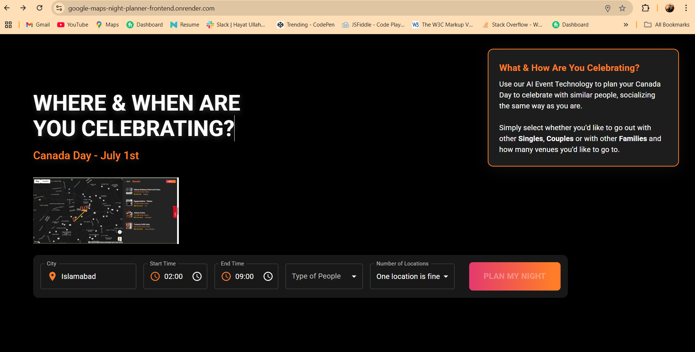
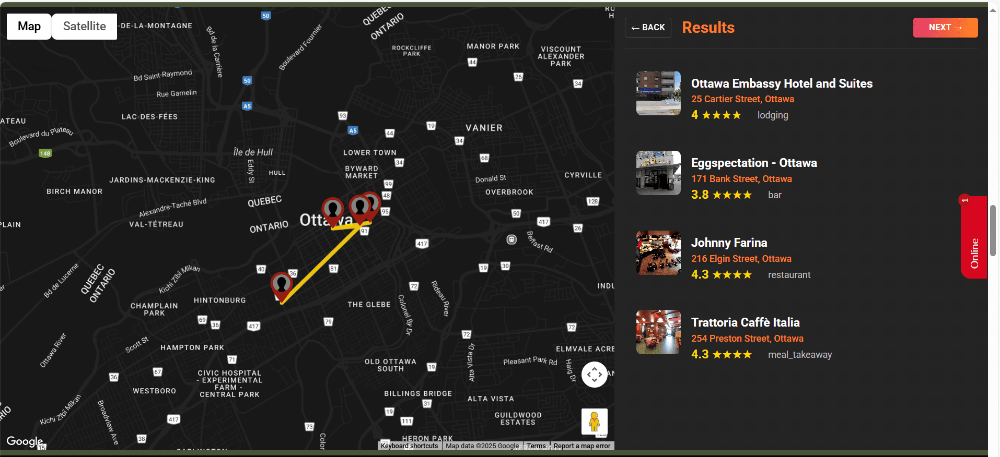
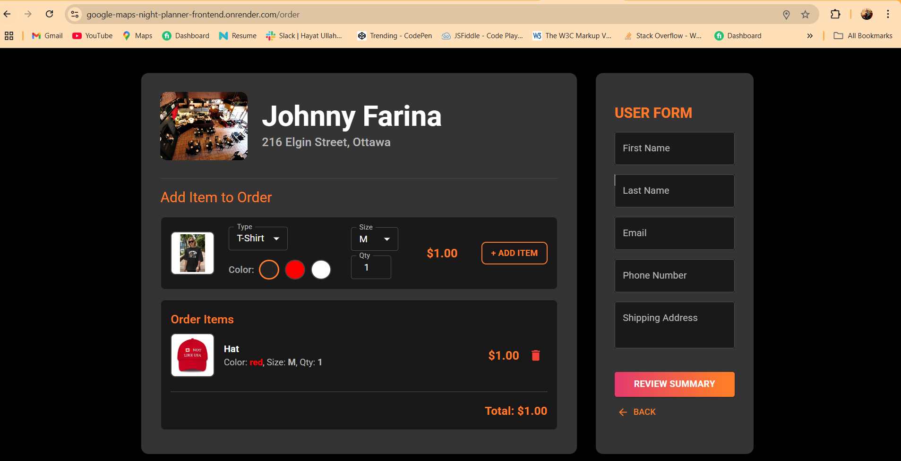
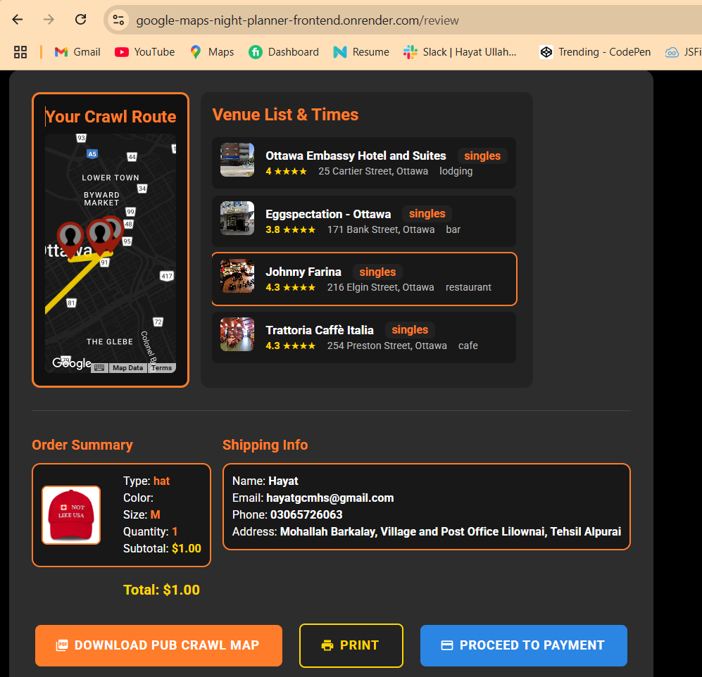
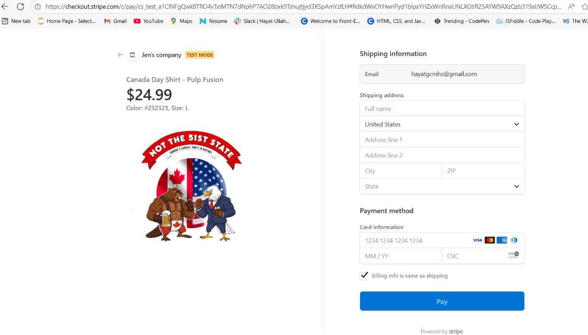

# Canada Day Night Planner App 🎆

A full-stack web application built using **React**, **Express.js**, **Google Maps JavaScript API**, and **Stripe**, designed to help users plan Canada Day night venue routes, customize and purchase event merchandise, and download their final plan — all in one seamless flow.

🌐 **Live App:** [Launch the Planner](https://google-maps-night-planner-frontend.onrender.com/)

---

## 🧭 Key Features

- **Smart City Detection:** Auto-detect or manually select the city via Google Places Autocomplete.
- **Venue Routing:** Users pick venue count, time range, and type (Singles, Couples, Family). Optimized route shown on an interactive map with polyline.
- **Dynamic Product Customization:**
  - T-shirts, Tank tops, Hats with live color previews.
  - Size selection (S to XXXL), quantity tracking, and live order summary.
- **Stripe Checkout Integration:** Secure multi-product checkout with shipping & contact info collected via Stripe UI.
- **Review & Download Plan:** Users review full crawl plan + products and download a copy before payment.
- **Mobile Friendly:** Fully responsive UI using Material UI.

---

## 🖼️ Screenshots

### 🏠 Home Page – Venue Selection

### 📍 Route Planning

### 👕 Product Customization & Cart

### ✅ Final Review Before Checkout

### 💳 Secure Payment via Stripe

---

## 🛠 Tech Stack

| Layer        | Tech                     |
|--------------|--------------------------|
| Frontend     | React.js, Material UI    |
| Backend      | Express.js (Node.js)     |
| Mapping      | Google Maps JavaScript API, Places API |
| Payment      | Stripe Checkout          |
| Hosting      | Render (Frontend & Backend) |

---

## 📂 Folder Structure

